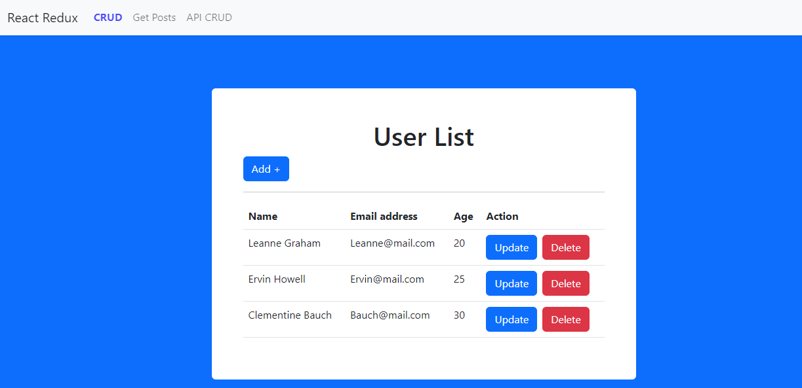
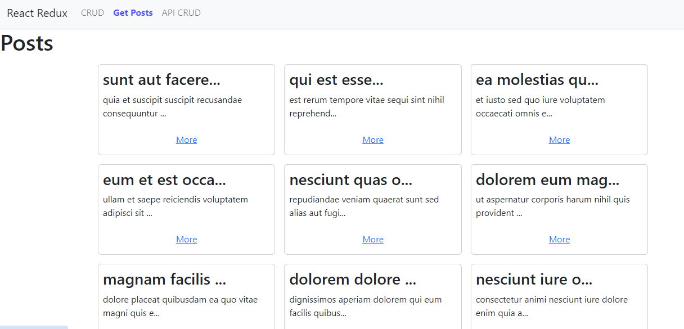
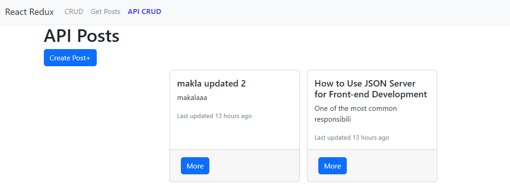
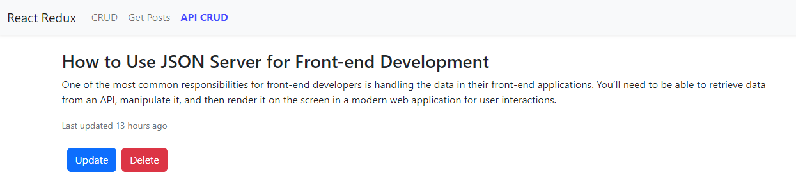
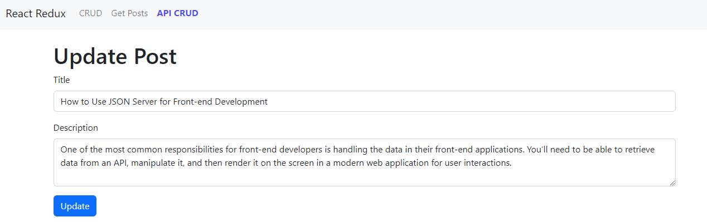

# Context Reducer 

This is a simple react Context API and useReducer application with CRUD operations and data fetch from an json server API.

## Features 

- React Context API and useReducer CRUD operations with object array
- Data fetch from json server API
- React Context API and useReducer CRUD operations with json server API

## Tools

- Vite React
- React Context API and useReducer
- React Router Dom
- fetch API
- Json Server
- Bootstrap


## Installation

This project requires [Node.js](https://nodejs.org/) v4+ to run.

Clone the project from git repository

```sh
git clone 
```

Install the dependencies and devDependencies and start the server.

```sh
npm install
```
Run the project

```sh
npm run dev
```
Run the json server

```sh
npm run json
```

## Screenshots






## Live Demo
[Demo]()


## Connect on Social Media
- [Twitter](https://twitter.com/AbdurRahim4G)
- [Instagram](https://www.instagram.com/abdurrahim4g/)
- [Facebook](https://www.facebook.com/Rahim72446)
- [LinkedIn](https://www.linkedin.com/in/abdur-rahim4g/)
- [YouTube](https://youtube.com/@AbdurRahimm)
